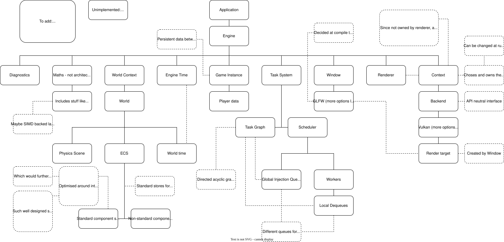

# Trivial Engine

A game engine designed for 2.5D games. The design will be more specialised and directed towards the creation of game with myself and a friend. The creation of the engine is to allow for complete freedom in the development of the game.

Building is done through cmake. It will pull in the base dependencies, e.g. GLFW, and VMA, to a dependencies directory, except for the Vukan SDK, which you must get yourself. For the Vulkan SDK, it is normally recommended to do so through the official LunarG Vulkan SDK.

Recent testing on windows revealed some unknown issues, this has not been fully explored but appears to be either a glfw or vulkan issue that does not surface an error yet does not result in proper execution. It is unclear if this is a consequence of windows being different or my machines install style of some of the required packages hiding a bug in dependency pulling in. This will be explored once I have need for Windows to be properly working (sometime mid 20s of August), so I am free to focus on some other stuff.

There is no formal licence and everything is free to use with no rights reserved.

Documentation for the parts of the engine as they are in an appropriate place to not have an overhaul to the api or the internals that would entirely change functionality. For instance the task system can be found with its initial documentation in there.

Tests are ai generated for the most part for the initial engine development. This simply allows for faster development when getting the base level working, once all in place and looking at first proper release the tests will be reviewed and cleaned up.

Current plan of action:
 - Arena allocator and general allocator (mix of binning as short path with b-tree management and fallback for large allocations, saves a bunch of sys calls in place of some b-tree searches) with a caching layer built into the allocators to reflect their use cases.
 - Basic physics system to test and profile the task system
 - Overhaul of the ECS system to have a proper efficient storage rather than the current placeholder mockup
    - Will be chunked archtype unless I can narrow done how to implement a sparse set with "archtypes" as the set types and well handle when different archtypes would want the same attribute with good cache locality for all the systems that benefit from it
 - More fleshed out physics system with parallel operation and SIMD backing
 - Extend graphics support to be more general to then visualise some basic 2d physics

The engine architecture can be seen below:

