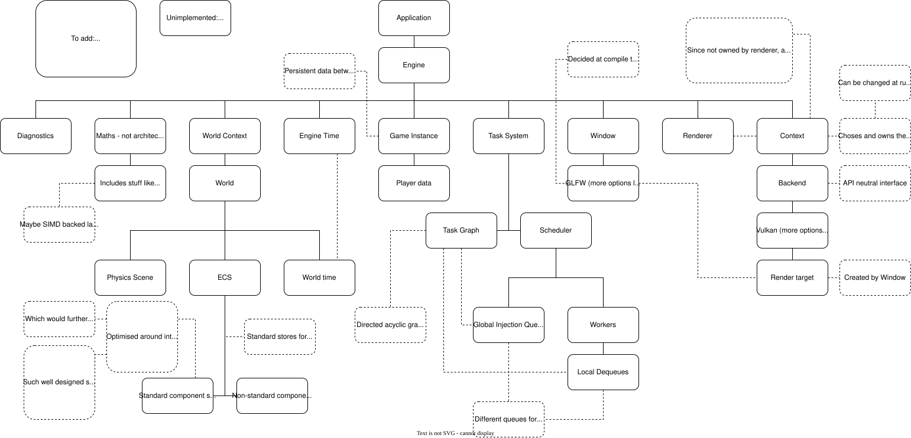

# Trivial Engine

A game engine designed for 2.5D games. The design will be more specialised and
directed towards the creation of game with myself and a friend. The creation of
the engine is to allow for complete freedom in the development of the game.

Build tooling (including grabbing dependencies) is handled via CMake, but built
on top is a python script that is recommended for usage for building and
especially for testing since some tests require running in isolated processes,
due to global state. The build script also ties in clang toolings for static
analysis and formatting to help keep the codebase consistent and clean.

Early testing has shown full functionality across Windows, Linux, and MacOS,
along with ARM64 and x86_64 architectures, but please report any issues found.

Licensed under the [Apache License, Version 2.0](LICENSE). Games and other
software built with the engine can use any licence, but must keep the
[NOTICE.md](NOTICE.md) file's attribution somewhere a user could reasonably
find it (e.g. a credits screen, documentation, or an in-app NOTICE display).
NOTICE.md also lists the engine's third-party dependencies and their licence
terms, and credits design references where deemed appropriate. A note on this
is it need not be a title screen as that can often interfere with the feel of a
game, and as such implementation of accreditation is deferred to the user.

Some documentation can be found in this repository, this documentation is not
complete, due to some bits with work ongoing and without a proper release
schedule keeping to having full documentation for each component added that may
likely change later. It is a personal project so a great formality of this is
neglected prior to a proper version 1.0.0.

## Current plan of action

- Documentation update and create new documentation
- Allocator
  - Arenas allocator
  - general allocator
    - small   <= 8 KiB   per-thread bins over 64 KiB pages, remote free lists
    - medium  <= 512 KiB TLSF over boundary tags, one pool per segment
    - large   > 512 KiB  page granular spans, multi segment runs above 2 MiB
  - Debug layer
- Expanded assertion macros (e.g. `TRIVIAL_ASSERT_TRUE`/`FALSE`/`EQ`/`NE`/`LT`/
`GT`, with matching `ASSUME` forms), then drop the
`readability-simplify-boolean-expr` NOLINTs
- Proper test and benchmarking framework
  - Benchmark allocator, probably against mimalloc and jemalloc
  - Full testing of allocator (segment allocator is briefly yet importantly not
  fully tested)
  - Sanitiser presets alongside `debug-tsan`: UBSan (cheap, broadly useful) and
  ASan (needs poisoning annotations in the engine allocators to see inside
  them), weighed against the `--all` run time
- Code generation flags, decided once benchmarks exist
  - `-O2` vs `-O3` for release (`relwithdebinfo` currently uses `-O2`, so
  profiled builds differ from shipped ones), LTO (ThinLTO on Clang, lets
  `mat4.cpp`'s SIMD multiplies inline into callers) and PGO
  - Target architecture: x86-64 level (`-march=x86-64-v2`/`v3`, `/arch:AVX2`)
  as a hardware floor, and `-mcpu=apple-m1` for macOS (safe for the 14.4 floor)
  - Floating point: `-ffp-contract=off` for identical results across ARM, x86
  and compilers (ARM fuses `a*b+c` by default, baseline x86 does not), and
  `-fno-math-errno` (Apple Clang default, GCC is not, so `sqrt` can become a
  library call on Linux), never `-ffast-math`
  - Standard library hardening (`_LIBCPP_HARDENING_MODE`,
  `_GLIBCXX_ASSERTIONS`, `_MSVC_STL_HARDENING`), debug mode in debug builds and
  possibly fast mode in release
  - Stack and control flow protection (`-fstack-protector-strong`,
  `-D_FORTIFY_SOURCE=3`, `-fcf-protection`/`-mbranch-protection=standard`,
  `/guard:cf`, `/sdl`), mainly worthwhile with networking or mods
- Basic physics system to test and profile the task system
  - Fixed timestep simulation with an integer nanosecond accumulator and the
  layer phase hooks (fixed pre/post physics, frame, present with interpolation
  alpha), with input buffering once an input system exists
  - Precise sleep for frame pacing: sleep until a per-platform margin before the
  deadline then spin with the CPU pause hint, fixed margins first and adaptive
  from measured overshoot only if needed
  - Optional system sleep detection to flag time jumps rather than relying on
  the max delta clamp
- First party parallel running tasks
- Proper automatic handle release, mark a flag on destruction (i.e. not some
reference counted form)
  - `lifetimebound` on `Task<T>::getResult()`, the result then dies with the
  handle so `launch(work).getResult()` held past the statement dangles
  - `[[clang::trivial_abi]]` on `Task<T>` so the destructor does not force it
  out of registers, keep it move-only with a moved-from handle invalid so only
  one owner sets the flag
- Clang thread safety analysis (`-Wthread-safety`), macros expand to nothing on
other compilers
  - `capability` on Mutex/SpinLock/EscalatingLock, `scoped_lockable` on
  LockGuard
  - `acquire_capability`/`release_capability`/`try_acquire_capability` on the
  lock and unlock functions
  - `guarded_by`/`pt_guarded_by` on shared members, `requires_capability` and
  `excludes` on functions that expect a lock to be held or not held
  - Limitations: no tracking of locks taken in one function and released in
  another, locking via callbacks (ParkingLot buckets), lock ordering across
  objects, or atomics, such spots need `no_thread_safety_analysis` -> see if
  some functions want adjustment to employ this effectively
- Fibre backing to task system with context switching
  - Split the task system's public and internal types: `TaskState`,
  `TaskSlot`, `TaskGraph`, `TaskPriorityQueue` and `Worker` sit in public
  headers only because `TaskSystem` holds them by value, so move them to
  `src/` or a `detail` namespace, drop the unused `task_graph.h` include from
  `task.h`, and decide on the direct `TaskPriorityQueue` test
  - Context switching from defined points and not called from outside of the
  running thread to keep the register handling simple, clean, and consistent
    - A need for context switching from outside would go in contrast to some of
    the intended principles of the task system with clean tasks run to
    completion independently, and without side effects
- Async support
- Overhaul of the ECS system to have a proper efficient storage rather than the
current placeholder mockup
  - Will be chunked archtype unless I can narrow done how to implement a sparse
  set with "archtypes" as the set types and well handle when different archtypes
  would want the same attribute with good cache locality for all the systems
  that benefit from it
  - Replace the `typeid`/`std::type_index` component store lookup with engine
  type ids so RTTI can be turned off (`-fno-rtti`, `/GR-`), noting that games
  deriving engine classes (e.g. `Layer`) would then need it off too
- Extend maths to give support for custom basic algorithms like min, max, clamp
- Add some sorting functions, along with a general one (SIMD where appropriate)
- More fleshed out physics system with parallel operation and SIMD backing
- Custom versions of stl vector, string, maps, stack, queue, set, list, and
other data structures like heaps, trees, graphs, and any others deemed relevant
  - Consider `-Wpadded` for a pass over struct layout (currently 37 sites,
  informational only)
  - Consider `-Wunsafe-buffer-usage` once spans and the custom containers cover
  most indexing, with `#pragma clang unsafe_buffer_usage begin`/`end` around
  the low level code that must use raw pointers (allocators, currently 56 sites
  across 7 files)
- Wall clock (`GetSystemTimePreciseAsFileTime`/`CLOCK_REALTIME`) for log
timestamps and save dates, as its own `SystemTime` type that never mixes with
`Instant`
  - Store as `timespec`-style `int64` seconds plus nanoseconds so every time an
  OS can be set to is representable (Windows allows 1601 to 30827), rather than
  `int64` nanoseconds clamped to 1677 to 2262
  - UTC calendar conversion with Joffe's fast 64-bit date algorithm
  (benjoffe.com/fast-date-64, BSL-1.0 so keep its notice if code is taken),
  which needs the high half of a 64x64 multiply (`__umulh` on MSVC is not
  `constexpr`, so needs a constant evaluation path)
- Extend graphics support
  - Load Vulkan at runtime (volk or `vkGetInstanceProcAddr`) instead of linking
  the loader, so a missing loader can fall back to another backend (e.g. Metal
  under `GraphicsApi::Auto`) rather than failing to launch, and a bundled
  loader/MoltenVK built for the macOS floor can ship in the app
  - Complete the `VkResult` name switch so `-Wswitch-enum` (C4061 on MSVC) can
  check it, with values newer than the oldest supported SDK wrapped in
  `#if VK_HEADER_VERSION >= N` guards (or a minimum version on
  `find_package(Vulkan)`), then remove the `TRIVIAL_DIAGNOSTIC_*` suppression
  around it

The engine architecture can be seen below:

